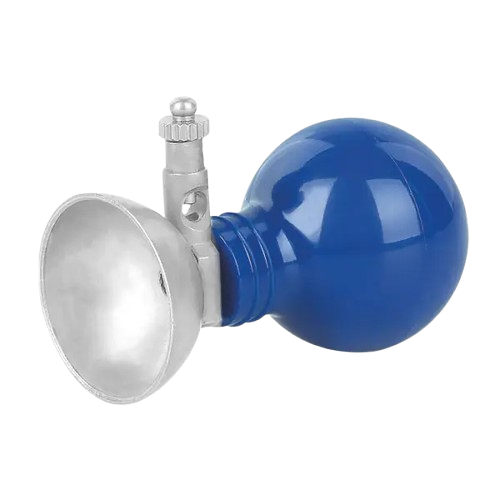

<h2>Theory</h2>
<h4>Introduction to Biomedical System</h4>

A biomedical system is an integrated setup of instruments and devices designed to safely measure, process, and present physiological information from the human body. These systems capture the body's electrical, mechanical, or chemical activities through sensors and transducers, and convert them into electrical signals. The signals are then conditioned, processed, and transformed into digital data that can be displayed, stored, or transmitted. By providing reliable and interpretable information, biomedical systems play a crucial role in medical diagnosis, patient monitoring, therapy control, and clinical decision-making. 

The fundamental principle underlying biomedical monitoring systems lies in the detection of biopotentials - small electrical signals generated by living tissues during normal physiological processes. These signals arise from ionic current flow in the body, created by the movement of charged particles across cell membranes during depolarization and repolarization cycles. 

The objectives of a biomedical system can be:

- Information gathering about physiological processes.  
- Diagnosis of diseases and abnormalities.  
- Evaluation of organ function or medical equipment. 
- Monitoring of patients in critical care or routine check-ups.  
- Control of therapeutic devices such as pacemakers or ventilators.
   

<h4>Components of a Biomedical System</h4>

<!-- 
 -->

A biomedical system consists of several interrelated components that work together to measure and interpret physiological signals. Biomedical systems typically include a stimulus (if required), transducers to convert physiological variables into electrical signals, signal conditioning units for amplification and filtering, display devices for visualization, and recording or data-processing units for storage and analysis. In some cases, feedback or control mechanisms are also incorporated for automatic regulation of medical devices or therapies. 

 

<b>Figure-1: Block Diagram - Complete signal flow from human body to display.</b>
 

 
<h4 style="margin-left: -2%">1. Signal Source: The Human Body</h4>

The human body serves as a complex bioelectric generator, producing various types of signals through different physiological processes. The three primary bioelectric signals of clinical interest are ECG, EMG and EEG. 

<h4 style="margin-left: -2%">2. Stimulus</h4>

In many measurements, the response to some form of external stimulus is required. The instrumentation used to generate and present this stimulus to the subject is a vital part of the man-instrument system whenever responses are measured. The stimulus may be visual (e.g., a flash of light), auditory (e.g., a tone), tactile (e.g., a blow to the Achilles tendon), or direct electrical stimulation of some part of the nervous system. 

<h4 style="margin-left: -2%">3. The Transducer</h4>

In general, a transducer is defined as a device capable of converting one form of energy or signal to another. In the man-instrument system, each transducer is used to produce an electric signal that is an analog of the phenomenon being measured. The transducer may measure temperature, pressure, flow, or any of the other variables that can be found in the body, but its output is always an electric signal. As indicated in Figure 1, two or more transducers may be used simultaneously to obtain relative variations between phenomena. 

In biomedical systems, electrodes act as specific transducers for recording biopotentials such as ECG, EEG, and EMG. They convert the body's ionic currents into measurable electrical signals. Depending on the application, different types of electrodes are used:  

<h4>Types of Electrodes</h4>

<h4>  a). Microelectrodes</h4>

Electrodes used to measure bioelectric potentials near or within a single cell.

 

<b>Figure-2: Structure of a metal microelectrode for intracellular recordings.</b>
 

<h4> b). Skin Surface Electrodes</h4>

Electrodes used to measure ECG, EEG, and EMG potentials from the surface of the skin.

 

<b>Figure-3a: Suction cup electrodes used for ECG recording.</b>
 

 

<b>Figure-3b: Disposable adhesive electrodes.</b>
 

<h4 >c). Needle Electrodes
</h4>

Electrodes used to penetrate the skin to record EEG potentials from a local region of the brain or EMG potentials from a specific group of muscles.

 

<b>Figure-4: Needle electrodes for invasive recordings</b>
  

<h4>4. Signal-Conditioning Equipment</h4>
The part of the instrumentation system that amplifies, modifies, or in any other way changes the electric output of the transducer is called signal-conditioning (or sometimes signal-processing) equipment. Signal-conditioning equipment is also used to combine or relate the outputs of two or more transducers. Thus, for each item of signal-conditioning equipment, both the input and the output are electric signals, although the output signal is often greatly modified with respect to the input. 

<h4>a). Amplifiers</h4>
Since the biopotentials picked up by electrodes are very weak (in the range of microvolts to millivolts), they must be amplified before further processing. Amplifiers such as instrumentation amplifiers and operational amplifiers boost the signal strength while preserving its waveform characteristics. 
<h4>b). Filters</h4>
Physiological signals are often contaminated with noise, such as power line interference (50/60 Hz), motion artifacts,Electrode motion artifacts, or baseline wander. Filters are used to remove these unwanted components. Common types include: 
- Low-pass filters
- High-pass filters
- Band-pass filters
- Notch filters

<h4>5. Analog-to-Digital Conversion (ADC)</h4>
To enable computerized processing, storage, and display, the conditioned analog signals are passed through an Analog-to-Digital Converter (ADC). The ADC samples the continuous waveform at specific intervals and converts it into discrete digital values that can be interpreted by computers and microcontrollers. The choice of sampling rate and resolution is critical to ensure that important physiological information is preserved without distortion. 

<h4>6. Display Equipment</h4>
The electrical output from the signal-conditioning unit must be presented in a form that can be easily understood by human senses. The display device performs this function by converting the processed electrical signals into visual, auditory, or sometimes tactile information. This allows the measured data to be interpreted in a meaningful way. In biomedical systems, common display devices include monitors, oscilloscopes, or graphic pen recorders that provide a permanent record of physiological signals for analysis and diagnosis.
 

<h4>7. Recording, Data-Processing, and Transmission Equipment</h4>
In a biomedical system, recording equipment is used to store signals for future use, while data-processing units help in analyzing and interpreting the measurements. Transmission devices are used to send the data to another location, such as within a hospital or to remote centers for monitoring.
 
It is important to note that some devices, like a graphic pen recorder, mainly act as a display tool by producing a paper trace, whereas recording devices such as digital storage systems or tape recorders are used for saving data for playback and further study. 

<h4>8. Control devices</h4>
Where it is necessary or desirable to have automatic control of the stimulus transducers, or any other part of the man-instrument system, a control system is incorporated. This system usually consists of a feedback tool in which part of the output from the signal-conditioning or display equipment is used to control the operation of the system in some way.
 
